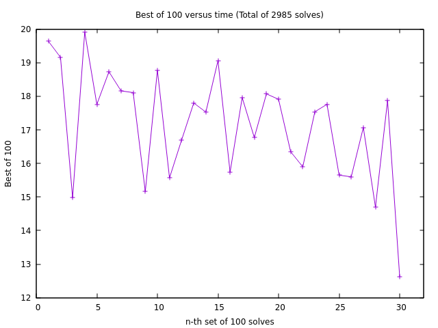

# cstimer-analyse _WIP_

> A ruby script to analyse your cstimer output for you and give you insights on your solve times

### What does this do?

- A graph of all your past solves

	> Yes, all 10k of them! :smile:

	

- A graph of your last 100 solves

	> Want to know just how that last session went?

	

- An evolution of your averages over time

	> How did your average of 100 improve / change over time?

	

- Evolution of your best of n-times

	> How fast / slow were you in besting yourself?

	

- :fire: :fire: Distribution of your time over any range

	> All my solves between 22 and 24 seconds, with an interval of 0.2 seconds.

	

### What kinds of insights?

- [x] Evolution of your averages of 12, 50, 100 and 1000s.
- [x] Time distribution over a very specific range of solve times
	* A distribution of 20-25 second solves with an increment of 0.5 seconds
	* A distribution of your best solves for each 100 solves and their increment over time
- [ ] Graphs and histograms for all kinds of stuff! (if the times had been timestamped in csTimer!)
- [ ] Some kind of a scatterplot
	* Frequency on the y-axis and the time on the x-axis, or time range? Not sure. TODO.
